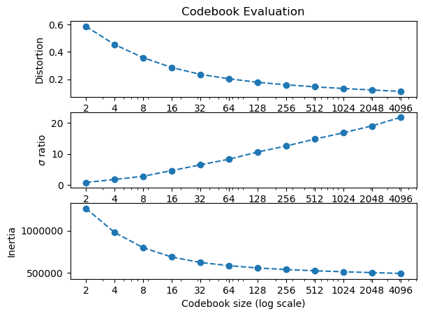

# On a 4.5 hour recording

- WAV file: `MARS_20161221_000046_SongSession_16kHz_HPF5Hz.wav`

- Selection file: `MARS_20161221_000046_SongSession_16kHz_HPF5HzNorm_labels.csv`.

**NOTE**: None of the WAV files referenced here are committed to this repo.

 
In the following, `$SOURCE_WAV` indicates the path to the source WAV file
above on the machine where the exercises below have been performed.

## Extracting the individual unit instances

Individual WAV files corresponding to the selections extracted as follows:

```
$ ecoz2 sgn extract --segments MARS_20161221_000046_SongSession_16kHz_HPF5HzNorm_labels.csv \
                    --wav ${SOURCE_WAV} \
                    --out-dir data/signals
...
      I2  714 instances
       F  340 instances
       H  141 instances
       D  175 instances
      Bu   43 instances
      I4   46 instances
       M   60 instances
      G2  307 instances
       I  471 instances
     Bmh    1 instances
       P  171 instances
       G   76 instances
      Bm  607 instances
      I3  324 instances
      C1   16 instances
       B   13 instances
      EG    3 instances
       E  713 instances
       A  512 instances
       ?  110 instances
       C  550 instances
      Bd   50 instances
      E1   27 instances
          5470 total extracted instances 
```

The extracted signals under `data/signals/` get organized in subdirectories
corresponding to the associated labels:

```
$ ls data/signals
?   A   B   Bd  Bm  Bmh Bu  C   C1  D   E   E1  EG  F   G   G2  H   I   I2  I3  I4  M   P
```

As an example, instances of the 'B' type are:

```
$ ls data/signals/B
from_MARS_20161221_000046_SongSession_16kHz_HPF5Hz.wav__s0123__588.77454_591.3191.wav
from_MARS_20161221_000046_SongSession_16kHz_HPF5Hz.wav__s0151__680.14154_680.8046.wav
from_MARS_20161221_000046_SongSession_16kHz_HPF5Hz.wav__s0267__1068.8552_1069.205.wav
from_MARS_20161221_000046_SongSession_16kHz_HPF5Hz.wav__s0274__1089.723_1090.6355.wav
from_MARS_20161221_000046_SongSession_16kHz_HPF5Hz.wav__s0278__1102.666_1103.1608.wav
from_MARS_20161221_000046_SongSession_16kHz_HPF5Hz.wav__s0708__2378.6963_2380.534.wav
from_MARS_20161221_000046_SongSession_16kHz_HPF5Hz.wav__s0910__2926.575_2929.6223.wav
from_MARS_20161221_000046_SongSession_16kHz_HPF5Hz.wav__s1679__5067.5444_5070.2764.wav
from_MARS_20161221_000046_SongSession_16kHz_HPF5Hz.wav__s2432__7145.495_7147.0107.wav
from_MARS_20161221_000046_SongSession_16kHz_HPF5Hz.wav__s3322__10079.092_10080.35.wav
from_MARS_20161221_000046_SongSession_16kHz_HPF5Hz.wav__s3463__10540.822_10543.197.wav
from_MARS_20161221_000046_SongSession_16kHz_HPF5Hz.wav__s4250__12907.783_12909.293.wav
from_MARS_20161221_000046_SongSession_16kHz_HPF5Hz.wav__s5107__15415.037_15417.307.wav
```

The name of each extracted file indicates the original WAV file name
and the corresponding information about the particular selection:  
`from_<original-wav>__s<selection#>__<begin-time>_<end-time>.wav`.
With the last file above as an example:

- selection number: 5107
- begin time in seconds: 15415.037
- end time in seconds: 15417.307

**NOTE**: As we are not interested in the '?' label, we remove those
instances to facilitate subsquent operations:

```
$ rm -rf data/signals/\?
```

## Generating the LPC prediction vector sequences

```
ecoz2 lpc -P 36 -W 45 -O 15 -m 10 -s 0.8 data/signals
```

This invocation means:

- `-P 36`: prediction order: 36
- `-W 45`: window size: 45ms
- `-O 15`: window offset: 15ms
- `-m 10`: process a class if it has at least 10 instances
- `-s 0.8`: split the generated predictor files into two sets,
  one with ~80% of the files for training (under `data/predictors/TRAIN/`),
  and the other ~20% for testing (under `data/predictors/TEST/`) for each class.
- `data/signals`: scan under this directory for all `.wav` files

```
$ ls data/predictors
TEST  TRAIN

$ ls data/predictors/TRAIN
A  B  Bd Bm Bu C  C1 D  E  E1 F  G  G2 H  I  I2 I3 I4 M  P

$ ls data/predictors/TEST
A  B  Bd Bm Bu C  C1 D  E  E1 F  G  G2 H  I  I2 I3 I4 M  P

$ ls data/predictors/TRAIN/B
from_MARS_20161221_000046_SongSession_16kHz_HPF5Hz.wav__s0123__588.77454_591.3191.prd
from_MARS_20161221_000046_SongSession_16kHz_HPF5Hz.wav__s0151__680.14154_680.8046.prd
from_MARS_20161221_000046_SongSession_16kHz_HPF5Hz.wav__s0267__1068.8552_1069.205.prd
from_MARS_20161221_000046_SongSession_16kHz_HPF5Hz.wav__s0274__1089.723_1090.6355.prd
from_MARS_20161221_000046_SongSession_16kHz_HPF5Hz.wav__s0278__1102.666_1103.1608.prd
from_MARS_20161221_000046_SongSession_16kHz_HPF5Hz.wav__s0910__2926.575_2929.6223.prd
from_MARS_20161221_000046_SongSession_16kHz_HPF5Hz.wav__s1679__5067.5444_5070.2764.prd
from_MARS_20161221_000046_SongSession_16kHz_HPF5Hz.wav__s2432__7145.495_7147.0107.prd
from_MARS_20161221_000046_SongSession_16kHz_HPF5Hz.wav__s3463__10540.822_10543.197.prd
from_MARS_20161221_000046_SongSession_16kHz_HPF5Hz.wav__s4250__12907.783_12909.293.prd
from_MARS_20161221_000046_SongSession_16kHz_HPF5Hz.wav__s5107__15415.037_15417.307.prd
```

> Note: the same naming scheme indicated above is used for subsequently
> generated files. In this case, with the `.prd` extension.

## Codebook generation

Using all TRAIN instances:

```
$ ecoz2 vq learn -P 36 -e 0.0005 data/predictors/TRAIN
Codebook generation:

prediction_order=36 class='_'  epsilon=0.0005

396970 training vectors (ε=0.0005)
Report: data/codebooks/_/eps_0.0005.rpt

data/codebooks/_/eps_0.0005_M_0002.cbook
M=2 avg_distortion=0.5851985882275309 sigma=0.8511174489461374 inertia=1264830.5773064673
...
data/codebooks/_/eps_0.0005_M_0004.cbook
M=4 avg_distortion=0.4535735676022798 sigma=1.7993267278198408 inertia=978858.7364325346
...
data/codebooks/_/eps_0.0005_M_0008.cbook
M=8 avg_distortion=0.3579777261329996 sigma=2.8367876955805627 inertia=797971.9953874183
...
data/codebooks/_/eps_0.0005_M_0016.cbook
M=16 avg_distortion=0.28624090565237326 sigma=4.664738774579296 inertia=687091.438212425
...
data/codebooks/_/eps_0.0005_M_0032.cbook
M=32 avg_distortion=0.2363660779364274 sigma=6.521346934730417 inertia=621777.6669599613
...
data/codebooks/_/eps_0.0005_M_0064.cbook
M=64 avg_distortion=0.20427796546709265 sigma=8.31926220700523 inertia=584180.8845381353
...
data/codebooks/_/eps_0.0005_M_0128.cbook
M=128 avg_distortion=0.17885449559950364 sigma=10.629795442343799 inertia=556739.7091387387
...
data/codebooks/_/eps_0.0005_M_0256.cbook
M=256 avg_distortion=0.16040117156878006 sigma=12.59414917683324 inertia=537804.6815875269
...
data/codebooks/_/eps_0.0005_M_0512.cbook
M=512 avg_distortion=0.14579442196594147 sigma=14.783142149077117 inertia=523368.49568261503
...
data/codebooks/_/eps_0.0005_M_1024.cbook
M=1024 avg_distortion=0.1336467720852285 sigma=16.85212698616244 inertia=511708.4576293516
...
data/codebooks/_/eps_0.0005_M_2048.cbook
M=2048 avg_distortion=0.12269332648726534 sigma=19.051095103755355 inertia=501427.5287329356
...
data/codebooks/_/eps_0.0005_M_4096.cbook
M=4096 avg_distortion=0.11226372559538686 sigma=21.783781007748665 inertia=491841.4214666356

```

The resulting clustering metrics above are shown in the following plot:



## Vector quantization

Quantize all TRAIN and TEST vectors using a number of the various
codebook sizes:

```
$ for M in 0512 1024 2048 4096; do 
   ecoz2 vq quantize --codebook data/codebooks/_/eps_0.0005_M_${M}.cbook data/predictors/TRAIN
   ecoz2 vq quantize --codebook data/codebooks/_/eps_0.0005_M_${M}.cbook data/predictors/TEST
done
```

Resulting sequences get generated under `data/sequences/{TRAIN,TEST}`.

As an example, `data/sequences/TRAIN/M2048/B` includes:
`from_MARS_20161221_000046_SongSession_16kHz_HPF5Hz.wav__s5107__15415.037_15417.307.seq`.

## HMM training and classification

For each class (label), an HMM model is trained using the corresponding
training sequences.

With performance measured as *average accuracy on test sequences*,
[summary.csv](summary.csv) captures the resulting
classification performance for various values of:

- `N`: number of states in the HMM models
- `M`: number of symbols (i.e., codebook size)
- `I`: maximum number of iterations in HMM training

> The parameter `-a` is fixed to `0.3` in this exploration.
> This parameter is used by the algorithm to stop the iterative process
> if the increment of the probability of the model acounting for the
> training sequences is not significant enough.

The complete exercise has been done with the help of [this script](hmm-exercise.sh).

With parallel coordinates the summary can be visualized as follows:

    python summary-parallel.py summary.csv


