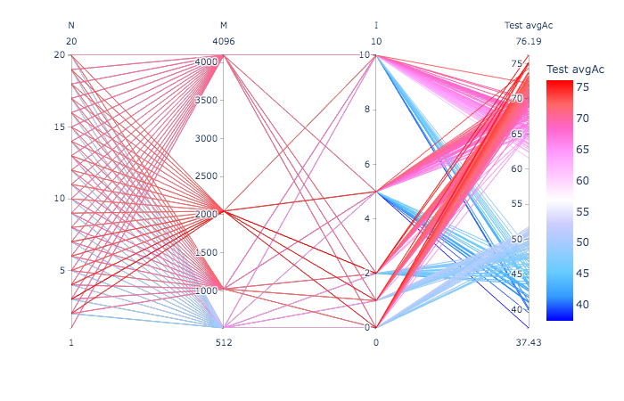

# On a 4.5 hour recording

- WAV file: `MARS_20161221_000046_SongSession_16kHz_HPF5Hz.wav`

- Selection file: `MARS_20161221_000046_SongSession_16kHz_HPF5HzNorm_labels.csv`.

**NOTE**: None of the WAV files referenced here are committed to this repo.

 
In the following, `$SOURCE_WAV` indicates the path to the source WAV file
above on the machine where the exercises below have been performed.

## Extracting the individual unit instances

Individual WAV files corresponding to the selections extracted as follows:

```
$ ecoz2 sgn extract --segments MARS_20161221_000046_SongSession_16kHz_HPF5HzNorm_labels.csv \
                    --wav ${SOURCE_WAV} \
                    --out-dir data/signals
...
          5470 total instances 
```

The extracted signals under `data/signals/` get organized in subdirectories
corresponding to the associated labels:

```
$ ls data/signals
?   A   B   Bd  Bm  Bmh Bu  C   C1  D   E   E1  EG  F   G   G2  H   I   I2  I3  I4  M   P
```

As an example, instances of the 'B' type are:

```
$ ls data/signals/B
from_MARS_20161221_000046_SongSession_16kHz_HPF5Hz.wav__10079.092_10080.35.wav
from_MARS_20161221_000046_SongSession_16kHz_HPF5Hz.wav__10540.822_10543.197.wav
from_MARS_20161221_000046_SongSession_16kHz_HPF5Hz.wav__1068.8552_1069.205.wav
from_MARS_20161221_000046_SongSession_16kHz_HPF5Hz.wav__1089.723_1090.6355.wav
from_MARS_20161221_000046_SongSession_16kHz_HPF5Hz.wav__1102.666_1103.1608.wav
from_MARS_20161221_000046_SongSession_16kHz_HPF5Hz.wav__12907.783_12909.293.wav
from_MARS_20161221_000046_SongSession_16kHz_HPF5Hz.wav__15415.037_15417.307.wav
from_MARS_20161221_000046_SongSession_16kHz_HPF5Hz.wav__2378.6963_2380.534.wav
from_MARS_20161221_000046_SongSession_16kHz_HPF5Hz.wav__2926.575_2929.6223.wav
from_MARS_20161221_000046_SongSession_16kHz_HPF5Hz.wav__5067.5444_5070.2764.wav
from_MARS_20161221_000046_SongSession_16kHz_HPF5Hz.wav__588.77454_591.3191.wav
from_MARS_20161221_000046_SongSession_16kHz_HPF5Hz.wav__680.14154_680.8046.wav
from_MARS_20161221_000046_SongSession_16kHz_HPF5Hz.wav__7145.495_7147.0107.wav
```

The name of each extracted file indicates the original WAV file name
and the corresponding begin and end times.

**NOTE**: As we are not interested in the '?' label, we remove those
instances to facilitate subsquent operations:

```
$ rm -rf data/signals/\?
```

## Generating the LPC prediction vector sequences

```
ecoz2 lpc -P 36 -W 45 -O 15 -m 10 -s 0.8 data/signals
```

The `-s 0.8` option splits the generated predictor files into
two categories (TRAIN and TEST) for each class:

```
$ ls data/predictors
TEST  TRAIN

$ ls data/predictors/TRAIN
A  B  Bd Bm Bu C  C1 D  E  E1 F  G  G2 H  I  I2 I3 I4 M  P

$ ls data/predictors/TEST
A  B  Bd Bm Bu C  C1 D  E  E1 F  G  G2 H  I  I2 I3 I4 M  P

$ ls data/predictors/TRAIN/B
from_MARS_20161221_000046_SongSession_16kHz_HPF5Hz.wav__10079.092_10080.35.prd
from_MARS_20161221_000046_SongSession_16kHz_HPF5Hz.wav__10540.822_10543.197.prd
from_MARS_20161221_000046_SongSession_16kHz_HPF5Hz.wav__1068.8552_1069.205.prd
from_MARS_20161221_000046_SongSession_16kHz_HPF5Hz.wav__1089.723_1090.6355.prd
from_MARS_20161221_000046_SongSession_16kHz_HPF5Hz.wav__12907.783_12909.293.prd
from_MARS_20161221_000046_SongSession_16kHz_HPF5Hz.wav__15415.037_15417.307.prd
from_MARS_20161221_000046_SongSession_16kHz_HPF5Hz.wav__2926.575_2929.6223.prd
from_MARS_20161221_000046_SongSession_16kHz_HPF5Hz.wav__5067.5444_5070.2764.prd
from_MARS_20161221_000046_SongSession_16kHz_HPF5Hz.wav__588.77454_591.3191.prd
from_MARS_20161221_000046_SongSession_16kHz_HPF5Hz.wav__680.14154_680.8046.prd
from_MARS_20161221_000046_SongSession_16kHz_HPF5Hz.wav__7145.495_7147.0107.prd
```

## Codebook generation

Using all TRAIN instances:

```
$ ecoz2 vq learn -P 36 -e 0.0005 data/predictors/TRAIN
num_actual_predictors: 4296

Codebook generation:

396678 training vectors (ε=0.0005)
Report: data/codebooks/_/eps_0.0005.rpt
data/codebooks/_/eps_0.0005_M_0002.cbook
(12)	DP=0.568047	DDprv=2253669e+3DD=225332D=489570.000150422    e+302
data/codebooks/_/eps_0.0005_M_0004.cbook
(8)	DP=0.452885	DDprv=179733	DD=179650	0.000465387
data/codebooks/_/eps_0.0005_M_0008.cbook
(21)	DP=0.357849	DDprv=142001	DD=141951	0.000352577
data/codebooks/_/eps_0.0005_M_0016.cbook
(14)	DP=0.283411	DDprv=112473	DD=112423	0.000441609
data/codebooks/_/eps_0.0005_M_0032.cbook
(15)	DP=0.236244	DDprv=93758.2	DD=93712.7	0.000484804
data/codebooks/_/eps_0.0005_M_0064.cbook
(15)	DP=0.204155	DDprv=81017.8	DD=80983.8	0.000419916
data/codebooks/_/eps_0.0005_M_0128.cbook
(18)	DP=0.179191	DDprv=71115.7	DD=71081.1	0.000486512
data/codebooks/_/eps_0.0005_M_0256.cbook
(19)	DP=0.159744	DDprv=63396.7	DD=63366.8	0.000471613
data/codebooks/_/eps_0.0005_M_0512.cbook
(15)	DP=0.145311	DDprv=57666.3	DD=57641.6	0.000429173
data/codebooks/_/eps_0.0005_M_1024.cbook
(14)	DP=0.133171	DDprv=52849.5	DD=52826.5	0.000444535
data/codebooks/_/eps_0.0005_M_2048.cbook
(14)	DP=0.122283	DDprv=48530.7	DD=48507.7	0.000489385
```

## Vector quantization

Quantize all TRAIN and TEST vectors using the 2048-codeword codebook:

```
$ ecoz2 vq quantize --codebook data/codebooks/_/eps_0.0005_M_2048.cbook data/predictors/TRAIN
...
total: 4296 sequences; dprm total = 0.120606

$ ecoz2 vq quantize --codebook data/codebooks/_/eps_0.0005_M_2048.cbook data/predictors/TEST
...
total: 1060 sequences; dprm total = 0.131448
```

Resulting sequences get generated under `data/sequences/{TRAIN,TEST}`.

## HMM training and classification

For each class (label), an HMM model is trained using the corresponding
training sequences.


With performance measured as *average accuracy* on test sequences,
[summary.csv](summary.csv) captures the resulting
classification performance for various values of:

- `N`: number of states in the HMM models
- `M`: number of symbols
- `I`: maximum number of iterations in HMM training

> The parameter `-a` is fixed to `0.3` in this exploration.
> This parameter is used by the algorithm to stop the iterative process
> if the increment of the probability of the model acounting for the
> training sequences is not significant enough.

The complete exercise has been done with the help of [this script](hmm-exercise.sh).

With parallel coordinates the summary can be visualized as follows:

    python summary-parallel.py

The parameter combination with the highest test average accuracy is
highlighted in this plot:



while the following shows a few of the combinations corresponding to the
highest test average accuracies:


With `2048` clearly as the best `M` parameter, these plots also suggest
that low values for `N` and `I` provide the best performance for the
dataset under experimentation.

What follows is a closer examination of the performance of the particular
set of parameters, `N = 3`, `M = 2048`, `I = 2`, `a = 0.3`,
on the test instances.
 
Confusion matrix:
 
```
            0   1   2   3   4   5   6   7   8   9  10  11  12  13  14  15  16  17  18  19     tests   errors

   A   0  100   0   0   0   0   0   0   0   0   0   0   0   0   0   1   0   1   0   0   0      102       2
   B   1    0   1   0   0   1   0   0   0   0   0   0   0   0   0   0   0   0   0   0   0        2       1
  Bd   2    0   0   4   2   1   0   0   0   0   0   0   0   0   0   0   0   2   0   0   0        9       5
  Bm   3    3   1   5  78  10   0   0   1   0   0   0   1   1   0   0   3  13   4   1   0      121      43
  Bu   4    0   0   1   0   7   0   0   0   0   0   0   0   0   0   0   0   0   0   0   0        8       1
   C   5    0   0   0   1   0  92   0   1   0   1   8   0   3   0   2   1   0   0   0   0      109      17
  C1   6    0   0   0   0   0   0   3   0   0   0   0   0   0   0   0   0   0   0   0   0        3       0
   D   7    0   0   0   0   0   1   0  28   1   0   2   0   0   0   2   0   0   0   0   0       34       6
   E   8    0   0   0   0   0   4   0   5 103   5   0   3   7   0   7   2   0   0   0   6      142      39
  E1   9    0   0   0   0   0   0   0   0   0   4   0   0   1   0   0   0   0   0   0   0        5       1
   F  10    0   0   0   0   0   0   0   2   0   0  63   0   1   0   0   0   0   0   1   0       67       4
   G  11    0   0   0   1   0   0   0   0   0   0   0  10   1   0   0   0   0   0   1   2       15       5
  G2  12    0   0   0   0   0   1   0   0   2   7   0   0  51   0   0   0   0   0   0   0       61      10
   H  13    0   0   0   0   0   0   0   0   0   0   0   0   0  25   0   0   1   0   2   0       28       3
   I  14    0   0   0   0   0   0   0   1   6   0   0   1   5   0  67  12   1   0   0   1       94      27
  I2  15    0   0   0   0   0   0   0   0   4   0   0   0   3   0  11 120   3   0   0   1      142      22
  I3  16    0   0   0   2   0   0   0   0   0   0   0   0   0   0   0   4  51   6   1   0       64      13
  I4  17    0   0   2   2   0   0   0   0   0   0   0   0   0   0   0   1   0   4   0   0        9       5
   M  18    0   0   0   0   0   0   0   0   0   0   0   0   1   1   0   0   0   0   9   0       11       2
   P  19    0   0   0   0   0   0   0   0   2   0   0   1   3   0   1   0   0   2   3  22       34      12
```

and here's the classification ranking ("candidate order") for each class,
with rows sorted by decreasing accuracy:

``` 
     class     accuracy    tests      candidate order
  C1     6      100.00%     3          3   0   0   0   0   0   0   0   0   0   0   0   0   0   0   0   0   0   0   0
   A     0       98.04%   102        100   1   0   0   0   0   0   1   0   0   0   0   0   0   0   0   0   0   0   0
   F    10       94.03%    67         63   1   1   1   0   1   0   0   0   0   0   0   0   0   0   0   0   0   0   0
   H    13       89.29%    28         25   1   2   0   0   0   0   0   0   0   0   0   0   0   0   0   0   0   0   0
  Bu     4       87.50%     8          7   1   0   0   0   0   0   0   0   0   0   0   0   0   0   0   0   0   0   0
  I2    15       84.51%   142        120  15   4   0   0   1   1   1   0   0   0   0   0   0   0   0   0   0   0   0
   C     5       84.40%   109         92   8   5   2   2   0   0   0   0   0   0   0   0   0   0   0   0   0   0   0
  G2    12       83.61%    61         51   7   2   1   0   0   0   0   0   0   0   0   0   0   0   0   0   0   0   0
   D     7       82.35%    34         28   3   1   1   1   0   0   0   0   0   0   0   0   0   0   0   0   0   0   0
   M    18       81.82%    11          9   1   0   0   0   0   0   0   0   1   0   0   0   0   0   0   0   0   0   0
  E1     9       80.00%     5          4   1   0   0   0   0   0   0   0   0   0   0   0   0   0   0   0   0   0   0
  I3    16       79.69%    64         51  10   1   2   0   0   0   0   0   0   0   0   0   0   0   0   0   0   0   0
   E     8       72.54%   142        103  26   8   2   2   0   1   0   0   0   0   0   0   0   0   0   0   0   0   0
   I    14       71.28%    94         67  14   9   2   1   0   0   0   0   1   0   0   0   0   0   0   0   0   0   0
   G    11       66.67%    15         10   0   0   3   2   0   0   0   0   0   0   0   0   0   0   0   0   0   0   0
   P    19       64.71%    34         22   6   1   1   0   3   0   1   0   0   0   0   0   0   0   0   0   0   0   0
  Bm     3       64.46%   121         78  20   6   6   2   1   0   1   3   1   0   1   1   0   1   0   0   0   0   0
   B     1       50.00%     2          1   0   0   0   0   0   0   0   0   1   0   0   0   0   0   0   0   0   0   0
  Bd     2       44.44%     9          4   1   1   0   2   0   0   1   0   0   0   0   0   0   0   0   0   0   0   0
  I4    17       44.44%     9          4   1   1   2   0   1   0   0   0   0   0   0   0   0   0   0   0   0   0   0

       TOTAL     79.43%   1060        842 117  42  23  12   7   2   5   3   4   0   1   1   0   1   0   0   0   0   0
  avg_accuracy   76.19%       
```

Some observations:

- Overall average accuracy: 76.19%

- Class "A" seems pretty well modeled given the 98.04% correct classification
  on 100 out of 102 test instances

    - 1 instance misclassified as "I" (class id 14)
    - 1 instance misclassified as "I3" (class id 16)

- Class "F" also pretty well modeled with 94.03% accuracy on 67 instances

- Except for "C1" (100% accuracy but only on 3 instances), the least performant
  classes have in general a very low number of test instances,
  that is, a relatively low number of corresponding training instances
  (see note about the `-s 0.8` option above).
  So, we may just be facing lack of enough data to train the models.
