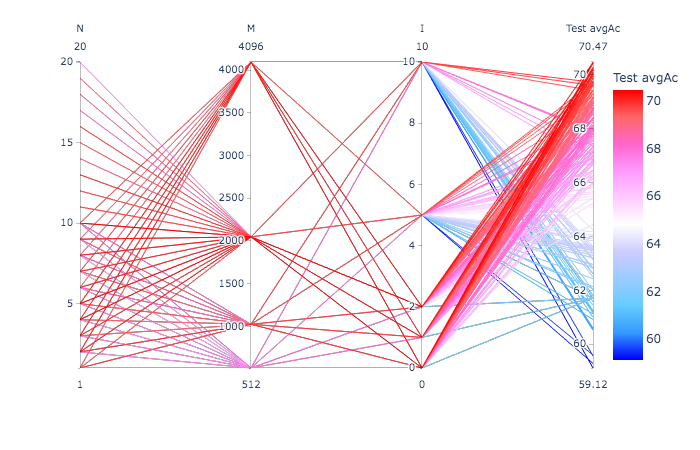
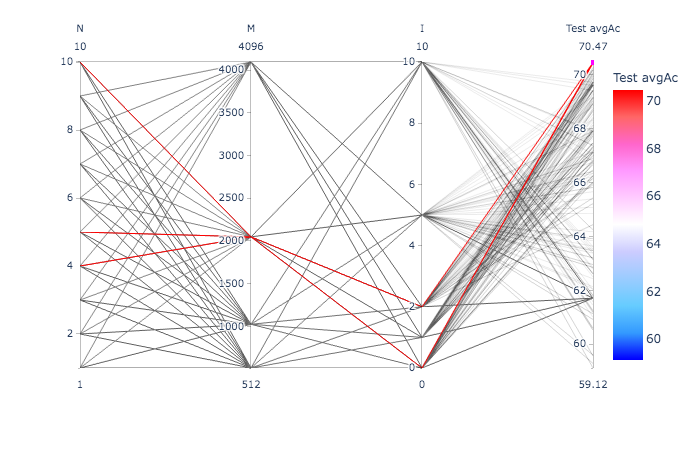
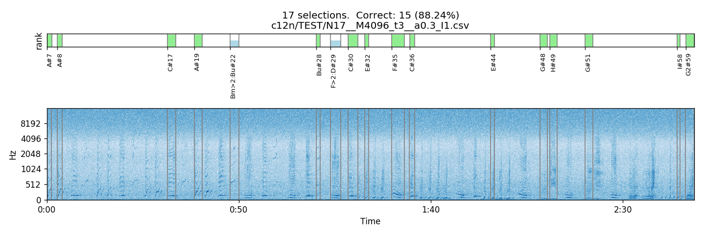
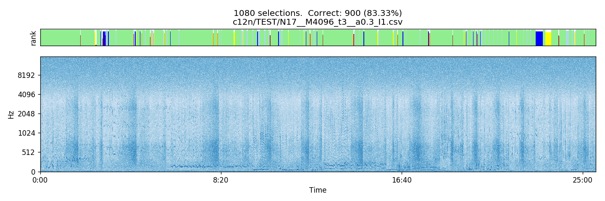
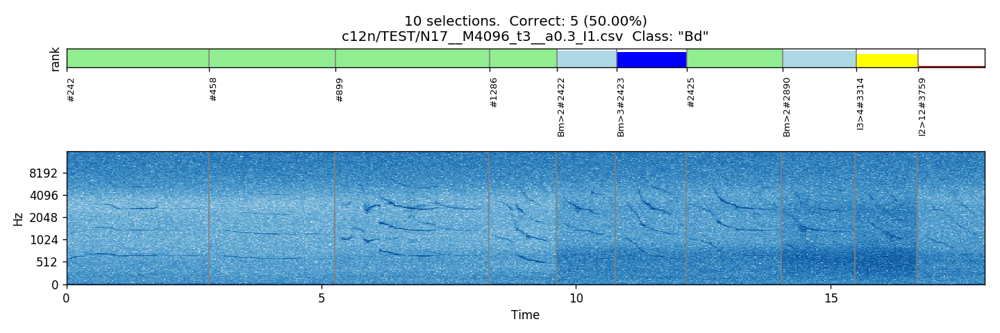
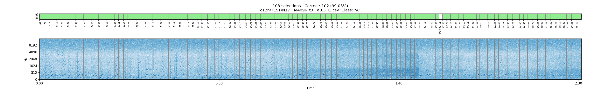
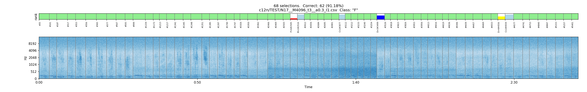

# On a 4.5 hour recording

Similar to ../exerc01.

- WAV file: `MARS_20161221_000046_SongSession_16kHz_HPF5Hz.wav`

- Selection file: `../exerc01/MARS_20161221_000046_SongSession_16kHz_HPF5HzNorm_labels.csv`.


## Extracting the individual unit instances

```
$ ecoz2 sgn extract --segments ../exerc01/MARS_20161221_000046_SongSession_16kHz_HPF5HzNorm_labels.csv \
                    --wav ${SOURCE_WAV} \
                    --out-dir data/signals

Loading .../MARS_20161221_000046_SongSession_16kHz_HPF5Hz.wav
num_samples: 266117287  sample_rate: 16000  bits_per_sample: 16  sample_format = Int
duration: 16632  sample_period: 0.0000625
parsed ranges = []
       M   60 instances
       D  175 instances
      EG    3 instances
      E1   27 instances
      Bd   50 instances
       B   13 instances
      I2  714 instances
       F  340 instances
      Bm  608 instances
       P  171 instances
      G2  307 instances
      I3  324 instances
      I4   46 instances
       A  512 instances
       C  550 instances
       ?  110 instances
       I  471 instances
       H  141 instances
      Bu   43 instances
       E  713 instances
       G   76 instances
      C1   16 instances
          5470 total extracted instances
```

```
$ rm -rf data/signals/\?
```

Eg., `data/signals/B/00123.wav`, indicating that this is the selection
123 from the original file.

## Generating the LPC prediction vector sequences

Note: no train/test split here as in exerc01.

```
ecoz2 lpc -P 36 -W 45 -O 15 -m 10 data/signals
```

Eg., `data/predictors/B/00123.prd`, corresponding to the signal above.


## Generating the TRAIN and TEST predictor lists

`tt-list.csv` will contain all the available predictor filenames with
~80% per class marked as "TRAIN" and ~20% as "TEST":

```
$ echo "tt,class,selection" > tt-list.csv
$ for class in `ls data/predictors/`; do
    ecoz2 util split --train-fraction 0.8 --file-ext .prd --files data/predictors/${class} >> tt-list.csv
done
```

The totals:
```
$ grep TRAIN tt-list.csv| wc -l
    4277
$ grep TEST tt-list.csv| wc -l
    1080
```

## Codebook generation

Using all TRAIN instances:

```
$ ecoz2 vq learn --prediction-order 36 --epsilon 0.0005 --predictors tt-list.csv

vq_learn: base_codebook_opt=None prediction_order=Some(36), epsilon=0.0005 codebook_class_name=_ predictor_filenames: 4277

Codebook generation:

prediction_order=36 class='_'  epsilon=0.0005

393993 training vectors (ε=0.0005)
Report: data/codebooks/_/eps_0.0005.rpt
...
```

## Vector quantization

Quantize all vectors (TRAIN and TEST) using a number of the various
codebook sizes:

```
$ for M in 0512 1024 2048 4096; do 
   ecoz2 vq quantize --codebook data/codebooks/_/eps_0.0005_M_${M}.cbook data/predictors
done
```

Resulting sequences get generated under `data/sequences/M<M>/`.

Eg.: `data/sequences/M512/B/00123.seq`


## HMM training and classification

Running ./hmm-exercise.sh






## Visualization of some classification results

Classification done using a new option `--c12n` (for "classification")
to generate report
[`c12n/TEST/N17__M4096_t3__a0.3_I1.csv`](c12n/TEST/N17__M4096_t3__a0.3_I1.csv)
with all details about rankings:

     ecoz2 hmm classify \
        --c12n c12n/TEST/N17__M4096_t3__a0.3_I1.csv \
        --models data/hmms/N17__M4096_t3__a0.3_I1 \
        -M=4096 --tt=TEST --sequences tt-list.csv

Each data row in the report corresponds to a classification case.
With one row as an example:

```csv
data/sequences/M4096/A/00007.seq, A, *, 1, A, C, I2, I3, I4, I, E, D, G2, F, C1, P, Bd, Bm, H, Bu, G, E1, B, M
```

The columns are:

- `seq_filename`: the sequence filename (`data/sequences/M4096/A/00007.seq`),
  whose structure indicates the particular selection number (00007)
- `seq_class_name`: the label associated with the sequence (A)
- `correct`: a star `*` when the classification is correct, or `!` when incorrect
  (just as a quick visual element)
- `rank`: the rank of the model corresponding to the sequence (that is, with
  same class name), with 1 indicating a correct classification,
  2 indicating it was 2nd place, etc.
- `r1`, ...: columns with the complete ranking of the models
  in order of decreasing probability.

Based on this report, and along with the original signal and labelling files,
a python script was used to generate the plots below, which show
the results associated with the signal for certain intervals.

     c12n.plot.py --cover  \
        --signal ../MARS_20161221_000046_SongSession_16kHz_HPF5Hz.wav \
        --segments ../exerc01/MARS_20161221_000046_SongSession_16kHz_HPF5HzNorm_labels.csv \
        --c12n c12n/TEST/N17__M4096_t3__a0.3_I1.csv   \
        --out-prefix c12n/TEST/



This shows the location of the selections (delimited by gray vertical lines)
on both the rank subplot at the top and the spectrogram subplot at the bottom.
For each selection, the label on the x axis in the rank subplot indicates
the selection number and the color and height of the bar reflect the rank
of the most probable model: full green bar for rank 1 (meaning correct
classification), and other colors and less tall bars for other ranks.
For misclassifications, the label also shows the best model.

The above uses `--cover` to show the relevant interval in the original
signal containing the selections in the input file.

Alternatively, to put together the selections next to each other, the
`--concat` option can be used:

    c12n.plot.py --concat  \
        --signal ../MARS_20161221_000046_SongSession_16kHz_HPF5Hz.wav \
        --segments ../exerc01/MARS_20161221_000046_SongSession_16kHz_HPF5HzNorm_labels.csv \
        --c12n c12n/TEST/N17__M4096_t3__a0.3_I1.csv   \
        --out-prefix c12n/TEST/



In this case, due to the large number of selections, the classification
labels and the vertical lines delimiting the segments are not displayed.

To restrict the visualization to a particular class or rank, the options
`--class` and `--rank` can be used.

For example:

    c12n.plot.py --concat --class Bd \
        --signal ../MARS_20161221_000046_SongSession_16kHz_HPF5Hz.wav \
        --segments ../exerc01/MARS_20161221_000046_SongSession_16kHz_HPF5HzNorm_labels.csv \
        --c12n c12n/TEST/N17__M4096_t3__a0.3_I1.csv   \
        --out-prefix c12n/TEST/



----

A couple of more classes:

    c12n.plot.py --concat --class A \
        --signal ../MARS_20161221_000046_SongSession_16kHz_HPF5Hz.wav \
        --segments ../exerc01/MARS_20161221_000046_SongSession_16kHz_HPF5HzNorm_labels.csv \
        --c12n c12n/TEST/N17__M4096_t3__a0.3_I1.csv   \
        --out-prefix c12n/TEST/



    c12n.plot.py --concat --class F \
        --signal ../MARS_20161221_000046_SongSession_16kHz_HPF5Hz.wav \
        --segments ../exerc01/MARS_20161221_000046_SongSession_16kHz_HPF5HzNorm_labels.csv \
        --c12n c12n/TEST/N17__M4096_t3__a0.3_I1.csv   \
        --out-prefix c12n/TEST/


