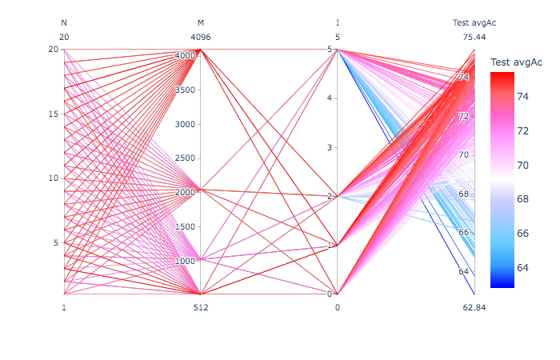
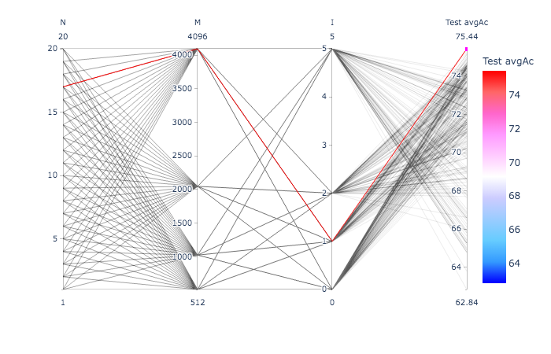
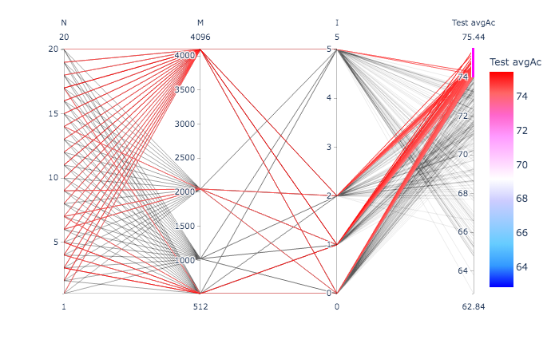

# On a 4.5 hour recording

Similar to ../exerc01.

- WAV file: `MARS_20161221_000046_SongSession_16kHz_HPF5Hz.wav`

- Selection file: `../exerc01/MARS_20161221_000046_SongSession_16kHz_HPF5HzNorm_labels.csv`.


## Extracting the individual unit instances

```
$ ecoz2 sgn extract --segments ../exerc01/MARS_20161221_000046_SongSession_16kHz_HPF5HzNorm_labels.csv \
                    --wav ${SOURCE_WAV} \
                    --out-dir data/signals

Loading .../MARS_20161221_000046_SongSession_16kHz_HPF5Hz.wav
num_samples: 266117287  sample_rate: 16000  bits_per_sample: 16  sample_format = Int
duration: 16632  sample_period: 0.0000625
parsed ranges = []
       M   60 instances
       D  175 instances
      EG    3 instances
      E1   27 instances
      Bd   50 instances
       B   13 instances
      I2  714 instances
       F  340 instances
      Bm  608 instances
       P  171 instances
      G2  307 instances
      I3  324 instances
      I4   46 instances
       A  512 instances
       C  550 instances
       ?  110 instances
       I  471 instances
       H  141 instances
      Bu   43 instances
       E  713 instances
       G   76 instances
      C1   16 instances
          5470 total extracted instances
```

```
$ rm -rf data/signals/\?
```

Eg., `data/signals/B/00123.wav`, indicating that this is the selection
123 from the original file.

## Generating the LPC prediction vector sequences

Note: no train/test split here as in exerc01.

```
ecoz2 lpc -P 36 -W 45 -O 15 -m 10 data/signals
```

Eg., `data/predictors/B/00123.prd`, corresponding to the signal above.


## Generating the TRAIN and TEST predictor lists

`tt-list.csv` will contain all the available predictor filenames with
~80% per class marked as "TRAIN" and ~20% as "TEST":

```
$ echo "tt,class,selection" > tt-list.csv
$ for class in `ls data/predictors/`; do
    ecoz2 util split --train-fraction 0.8 --file-ext .prd --files data/predictors/${class} >> tt-list.csv
done
```

The totals:
```
$ grep TRAIN tt-list.csv| wc -l
    4277
$ grep TEST tt-list.csv| wc -l
    1080
```

## Codebook generation

Using all TRAIN instances:

```
$ ecoz2 vq learn --prediction-order 36 --epsilon 0.0005 --predictors tt-list.csv

vq_learn: base_codebook_opt=None prediction_order=Some(36), epsilon=0.0005 codebook_class_name=_ predictor_filenames: 4277

Codebook generation:

prediction_order=36 class='_'  epsilon=0.0005

393993 training vectors (ε=0.0005)
Report: data/codebooks/_/eps_0.0005.rpt
...
```

The resulting clustering metrics above are shown in the following plot:

```
cb.plot_evaluation.py data/codebooks/_/eps_0.0005.rpt.csv
```


## Vector quantization

Quantize all vectors (TRAIN and TEST) using a number of the various
codebook sizes:

```
$ for M in 0512 1024 2048 4096; do 
   ecoz2 vq quantize --codebook data/codebooks/_/eps_0.0005_M_${M}.cbook data/predictors
done
```

Resulting sequences get generated under `data/sequences/M<M>/`.

Eg.: `data/sequences/M512/B/00123.seq`


## HMM training and classification

Running ./hmm-exercise.sh






