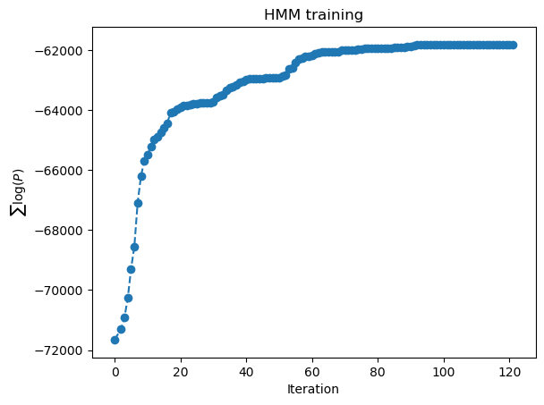

# On a 4.5 hour recording

Based on predictors under `../exerc02/data/predictors/`.

## Extracting the individual unit instances

```
$ ecoz2 sgn extract --segments ../exerc01/MARS_20161221_000046_SongSession_16kHz_HPF5HzNorm_labels.csv \
                    --wav ${SOURCE_WAV} \
                    --out-dir data/signals
                    
$ rm -rf data/signals/\?
```

## Generating the LPC prediction vector sequences

```
ecoz2 lpc -P 36 -W 45 -O 15 -m 10 data/signals
```


## Generating the TRAIN and TEST predictor lists

`tt-list.csv` will contain all the available predictor filenames with
~80% per class marked as "TRAIN" and ~20% as "TEST":

```
echo "tt,class,selection" > tt-list.csv
for class in `ls data/predictors/`; do
    ecoz2 util split --train-fraction 0.8 --file-ext .prd --files data/predictors/${class} >> tt-list.csv
done
```

The totals:
```
$ grep TRAIN tt-list.csv| wc -l
    4277
$ grep TEST tt-list.csv| wc -l
    1080
```

## Codebook generation

Using all TRAIN instances:

```
$ ecoz2 vq learn --prediction-order 36 --epsilon 0.0005 --predictors tt-list.csv
```


## Vector quantization

```
for M in 0512 1024 2048 4096; do 
   ecoz2 vq quantize --codebook data/codebooks/_/eps_0.0005_M_${M}.cbook data/predictors
done
```

## HMM training and classification

Running ./hmm-exercise.sh


- Overall, not as good performance comparared to previous exercises.
- Overfitting comes to mind again


## Some interesting convergence cases

(but exploration not exhaustive at all.)

N4__M1024_t3__a1_I120__Bu

> 

N4__M1024_t3__a1_I120__C1

> 

N10__M1024_t3__a1_I120__C1

> 

N10__M1024_t3__a1_I120__I3

> 


N5__M1024_t3__a1_I120__H

> 
