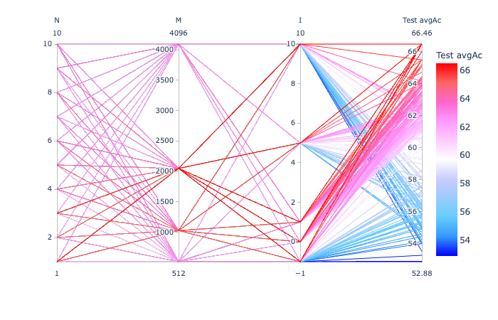
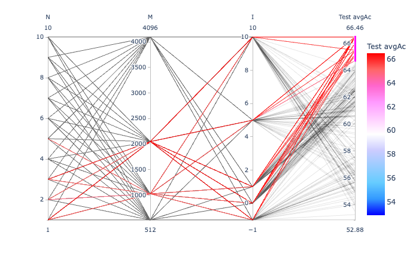
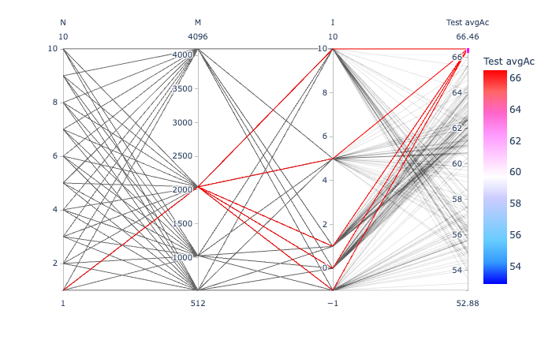
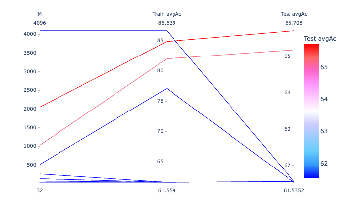
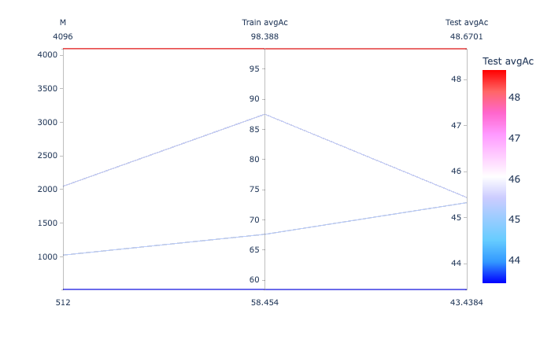

# On a 4.5 hour recording

Again, original data:

- WAV file: `MARS_20161221_000046_SongSession_16kHz_HPF5Hz.wav`
- Selection file: `MARS_20161221_000046_SongSession_16kHz_HPF5HzNorm_labels.csv`.

In this exercise, P = 20 according to rule of thumb P = 4 + f_s / 1000,
where the sampling frequence f_s is 16000 in our case.

This exercise based on the signals already extracted under `../exerc02/data/signals/`.

## Generating the LPC prediction vector sequences

Note: no train/test split (`-s`) in this step as in exerc01 (see below):

```
ecoz2 lpc -P 20 -W 45 -O 15 -m 10 ../exerc02/data/signals
```

## Generating the TRAIN and TEST predictor lists

`tt-list.csv` will contain all the available predictor filenames with
~80% per class marked as "TRAIN" and ~20% as "TEST":

```
$ echo "tt,class,selection" > tt-list.csv
$ for class in `ls data/predictors/`; do
    ecoz2 util split --train-fraction 0.8 --file-ext .prd --files data/predictors/${class} >> tt-list.csv
done
```

The totals:
```
$ grep TRAIN tt-list.csv| wc -l
    4277
$ grep TEST tt-list.csv| wc -l
    1080
```

## Codebook generation

Using all TRAIN instances:

```
$ ecoz2 vq learn --prediction-order 20 --epsilon 0.0005 --predictors tt-list.csv
vq_learn: base_codebook_opt=None prediction_order=Some(20), epsilon=0.0005 codebook_class_name=_ predictor_filenames: 4277

Codebook generation:

prediction_order=20 class='_'  epsilon=0.0005

394988 training vectors (ε=0.0005)
Report: data/codebooks/_/eps_0.0005.rpt
data/codebooks/_/eps_0.0005_M_0002.cbook

(desired_threads=8)
...
```

Note: as usual, `class='_'` means the the generated codebooks are not class specific.

## Vector quantization

Quantize all vectors (TRAIN and TEST) using some of the various codebook sizes:

```
$ for M in 0512 1024 2048 4096; do 
   ecoz2 vq quantize --codebook data/codebooks/_/eps_0.0005_M_${M}.cbook data/predictors
done
```


## HMM training and classification

```
./hmm-exercise.sh

ipython3 ../exerc01/summary-parallel.py hmm-summary.csv
```


 
 

 

## Naive Bayes training and classification

```
./nb-exercise.sh

ipython3 ../exerc01/summary-parallel.py nb-summary.csv
```



## Markov training and classification

```
./mm-exercise.sh

ipython3 ../exerc01/summary-parallel.py mm-summary.csv
```



