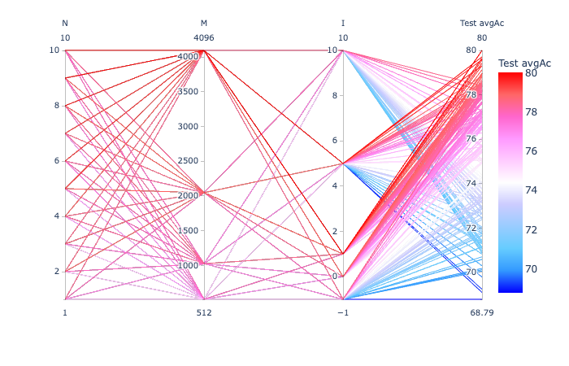
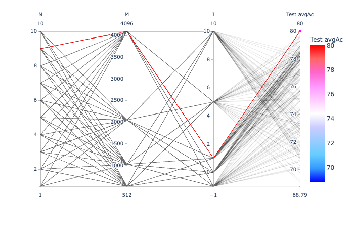
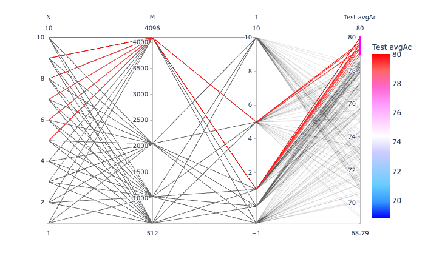
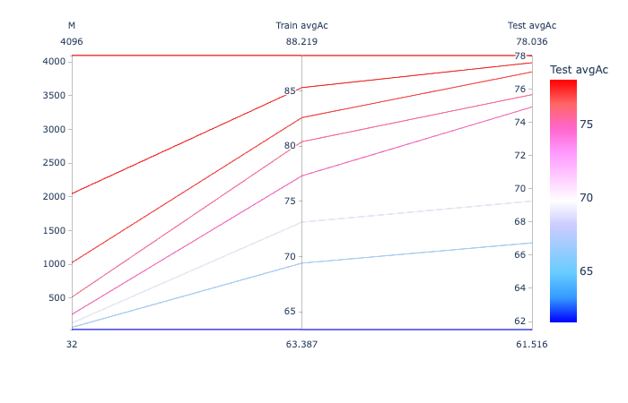

# On a 4.5 hour recording

In this exercise:
- P = 20 (as in exerc05)
- Only classes with at least 100 instances (i.e., 80 for training)

## Generating the LPC prediction vector sequences

```
$ ecoz2 lpc -P 20 -W 45 -O 15 -m 100 ../exerc02/data/signals

$ ls data/predictors
A  Bm C  D  E  F  G2 H  I  I2 I3 P
```

Let's see the actual number of instances per class:
```
$ for c in `ls data/predictors/`; do echo "`ls -l data/predictors/$c/*.prd | wc -l` $c instances"; done | sort
       141 H instances
       171 P instances
       175 D instances
       307 G2 instances
       324 I3 instances
       340 F instances
       471 I instances
       512 A instances
       550 C instances
       608 Bm instances
       713 E instances
       714 I2 instances
```

## Generating the TRAIN and TEST predictor lists

`tt-list.csv` will contain all the available predictor filenames with
~80% per class marked as "TRAIN" and ~20% as "TEST":

```
echo "tt,class,selection" > tt-list.csv
for class in `ls data/predictors/`; do
  ecoz2 util split --train-fraction 0.8 --file-ext .prd --files data/predictors/${class} >> tt-list.csv
done
```

The totals:
```
grep TRAIN tt-list.csv| wc -l
    4016
grep TEST tt-list.csv| wc -l
    1010
```

# VQ based classification

VQ based training and classification done with the help of this script:
[vq-exercise.sh](vq-exercise.sh).

Classification results:

```
CLASSIFYING TRAINING PREDICTORS
ecoz2 vq classify --codebooks data/codebooks/[A-Z]*/eps_0.0005_M_1024.cbook --predictors tt-list.csv --tt=TRAIN
number of codebooks: 12  number of predictors: 4016

     Confusion matrix:
            0   1   2   3   4   5   6   7   8   9  10  11     tests   errors

   A   0  408   0   1   0   0   0   0   0   0   0   0   0      409       1
  Bm   1    1 472   0   1   0   0   0   4   0   2   6   0      486      14
   C   2    0   0 438   0   0   0   0   0   1   1   0   0      440       2
   D   3    0   0   0 140   0   0   0   0   0   0   0   0      140       0
   E   4    0   0   0   0 570   0   0   0   0   0   0   0      570       0
   F   5    0   0   0   0   1 271   0   0   0   0   0   0      272       1
  G2   6    0   0   1   0   2   0 242   0   0   0   0   0      245       3
   H   7    0   0   0   0   0   0   0 112   0   0   0   0      112       0
   I   8    0   0   0   0   0   0   0   0 376   0   0   0      376       0
  I2   9    0   0   0   0   0   0   0   0   0 571   0   0      571       0
  I3  10    0   0   0   0   0   0   0   0   0   0 259   0      259       0
   P  11    0   0   0   0   0   0   1   0   0   0   0 135      136       1

     class     accuracy    tests      candidate order
   A     0       99.76%   409        408   1   0   0   0   0   0   0   0   0   0   0
  Bm     1       97.12%   486        472   7   6   0   1   0   0   0   0   0   0   0
   C     2       99.55%   440        438   2   0   0   0   0   0   0   0   0   0   0
   D     3      100.00%   140        140   0   0   0   0   0   0   0   0   0   0   0
   E     4      100.00%   570        570   0   0   0   0   0   0   0   0   0   0   0
   F     5       99.63%   272        271   1   0   0   0   0   0   0   0   0   0   0
  G2     6       98.78%   245        242   3   0   0   0   0   0   0   0   0   0   0
   H     7      100.00%   112        112   0   0   0   0   0   0   0   0   0   0   0
   I     8      100.00%   376        376   0   0   0   0   0   0   0   0   0   0   0
  I2     9      100.00%   571        571   0   0   0   0   0   0   0   0   0   0   0
  I3    10      100.00%   259        259   0   0   0   0   0   0   0   0   0   0   0
   P    11       99.26%   136        135   1   0   0   0   0   0   0   0   0   0   0

       TOTAL     99.45%   4016        3994  15   6   0   1   0   0   0   0   0   0   0
  avg_accuracy   99.51%
    error_rate    0.49%


CLASSIFYING TEST PREDICTORS
ecoz2 vq classify --codebooks data/codebooks/[A-Z]*/eps_0.0005_M_1024.cbook --predictors tt-list.csv --tt=TEST
number of codebooks: 12  number of predictors: 1010

     Confusion matrix:
            0   1   2   3   4   5   6   7   8   9  10  11     tests   errors

   A   0   99   0   0   0   1   0   1   0   0   2   0   0      103       4
  Bm   1    1  93   0   0   0   0   0   5   0   6  16   1      122      29
   C   2    0   0  90   2   4  13   0   0   0   0   0   1      110      20
   D   3    0   0   0  28   1   6   0   0   0   0   0   0       35       7
   E   4    0   0   6   5 115   0   6   1   9   0   0   1      143      28
   F   5    0   0   7   2   0  59   0   0   0   0   0   0       68       9
  G2   6    0   0   6   0   9   1  45   0   0   0   0   1       62      17
   H   7    0   0   0   0   0   0   0  28   0   1   0   0       29       1
   I   8    0   0   4   0  10   0   0   0  63  17   0   1       95      32
  I2   9    0   1   2   0   4   0   3   0   9 119   3   2      143      24
  I3  10    0   2   0   0   0   0   0   0   0   5  58   0       65       7
   P  11    0   0   0   0   7   1   0   1   0   4   0  22       35      13

     class     accuracy    tests      candidate order
   A     0       96.12%   103         99   0   1   1   1   0   1   0   0   0   0   0
  Bm     1       76.23%   122         93  15   9   4   0   1   0   0   0   0   0   0
   C     2       81.82%   110         90  17   0   0   3   0   0   0   0   0   0   0
   D     3       80.00%    35         28   7   0   0   0   0   0   0   0   0   0   0
   E     4       80.42%   143        115  22   5   0   1   0   0   0   0   0   0   0
   F     5       86.76%    68         59   7   1   1   0   0   0   0   0   0   0   0
  G2     6       72.58%    62         45   9   2   2   3   1   0   0   0   0   0   0
   H     7       96.55%    29         28   1   0   0   0   0   0   0   0   0   0   0
   I     8       66.32%    95         63  20   5   2   4   0   1   0   0   0   0   0
  I2     9       83.22%   143        119  13   4   4   2   1   0   0   0   0   0   0
  I3    10       89.23%    65         58   6   1   0   0   0   0   0   0   0   0   0
   P    11       62.86%    35         22   7   2   1   1   2   0   0   0   0   0   0

       TOTAL     81.09%   1010        819 124  30  15  15   5   2   0   0   0   0   0
  avg_accuracy   81.01%
    error_rate   18.99%
```
 
So, this gets avg_accuracy = 81.01%


# Regular traning and classification based on quantized observation sequences

The following as in most of the exercises, that is, first a general codebook generation
pahse using all training predictors; then classification with various techniques.

## Codebook generation

Using all TRAIN instances:

```
$ ecoz2 vq learn --prediction-order 20 --epsilon 0.0005 --predictors tt-list.csv
vq_learn: base_codebook_opt=None prediction_order=Some(20), epsilon=0.0005 codebook_class_name=_ predictor_filenames: 4016

Codebook generation:

prediction_order=20 class='_'  epsilon=0.0005

355436 training vectors (ε=0.0005)
Report: data/codebooks/_/eps_0.0005.rpt
data/codebooks/_/eps_0.0005_M_0002.cbook

(desired_threads=8)
...
```

## Vector quantization

Quantize all vectors (TRAIN and TEST) using some of the various codebook sizes:

```
$ for M in 0032 0064 0128 0256 0512 1024 2048 4096; do 
   ecoz2 vq quantize --codebook data/codebooks/_/eps_0.0005_M_${M}.cbook data/predictors
done
```


## HMM training and classification

```
./hmm-exercise.sh

ipython3 ../exerc01/summary-parallel.py hmm-summary.csv
```

All parameter combinations that were tried:



The best combination (N=9, M=4096, I=1):
 
 

Combinations resulting in avergace accuracy >= 79%:

 

## Naive Bayes training and classification

```
./nb-exercise.sh

ipython3 ../exerc01/summary-parallel.py nb-summary.csv
```



So, the larger the codebook the better the performance with Naive Bayes.
