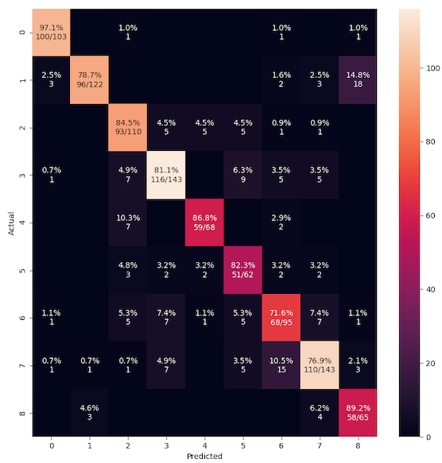

# On a 4.5 hour recording

In this exercise:

- P = 20 (as in exerc05)
- Only classes with at least 200 instances (i.e., 160 for training)

## Generating the LPC prediction vector sequences

```
$ ecoz2 lpc -P 20 -W 45 -O 15 -m 200 ../exerc02/data/signals

$ ls data/predictors
A  Bm C  E  F  G2 I  I2 I3
```

Actual number of instances per class:

```
$ for c in `ls data/predictors/`; do echo "`ls -l data/predictors/$c/*.prd | wc -l` $c instances"; done | sort
     307 G2 instances
     324 I3 instances
     340 F instances
     471 I instances
     512 A instances
     550 C instances
     608 Bm instances
     713 E instances
     714 I2 instances
```

## Generating the TRAIN and TEST predictor lists

`tt-list.csv` will contain all the available predictor filenames with
~80% per class marked as "TRAIN" and ~20% as "TEST":

```
echo "tt,class,selection" > tt-list.csv
for class in `ls data/predictors/`; do
  ecoz2 util split --train-fraction 0.8 --file-ext .prd --files data/predictors/${class} >> tt-list.csv
done
```

The totals:

```
grep TRAIN tt-list.csv| wc -l
    3628
grep TEST tt-list.csv| wc -l
    911
```

# VQ based classification

VQ based training and classification done with the help of this script:
[vq-exercise.sh](vq-exercise.sh).

Classification results:

```
CLASSIFYING TRAINING PREDICTORS
ecoz2 vq classify --codebooks data/codebooks/[A-Z]*/eps_0.0005_M_1024.cbook --predictors tt-list.csv --tt=TRAIN
number of codebooks: 9  number of predictors: 3628
     Confusion matrix:
            0   1   2   3   4   5   6   7   8     tests   errors

   A   0  408   0   1   0   0   0   0   0   0      409       1
  Bm   1    0 473   0   0   0   0   0   4   9      486      13
   C   2    0   0 438   0   1   0   1   0   0      440       2
   E   3    0   0   0 570   0   0   0   0   0      570       0
   F   4    0   0   0   1 271   0   0   0   0      272       1
  G2   5    0   0   0   2   0 243   0   0   0      245       2
   I   6    0   0   0   1   0   0 375   0   0      376       1
  I2   7    0   0   0   0   0   1   1 569   0      571       2
  I3   8    0   0   0   0   0   0   0   0 259      259       0

     class     accuracy    tests      candidate order
   A     0       99.76%   409        408   1   0   0   0   0   0   0   0
  Bm     1       97.33%   486        473   8   3   2   0   0   0   0   0
   C     2       99.55%   440        438   1   1   0   0   0   0   0   0
   E     3      100.00%   570        570   0   0   0   0   0   0   0   0
   F     4       99.63%   272        271   1   0   0   0   0   0   0   0
  G2     5       99.18%   245        243   2   0   0   0   0   0   0   0
   I     6       99.73%   376        375   1   0   0   0   0   0   0   0
  I2     7       99.65%   571        569   2   0   0   0   0   0   0   0
  I3     8      100.00%   259        259   0   0   0   0   0   0   0   0

       TOTAL     99.39%   3628        3606  16   4   2   0   0   0   0   0
  avg_accuracy   99.43%
    error_rate    0.57%


CLASSIFYING TEST PREDICTORS
ecoz2 vq classify --codebooks data/codebooks/[A-Z]*/eps_0.0005_M_1024.cbook --predictors tt-list.csv --tt=TEST
number of codebooks: 9  number of predictors: 911

     Confusion matrix:
            0   1   2   3   4   5   6   7   8     tests   errors

   A   0  100   0   0   0   0   1   0   2   0      103       3
  Bm   1    4 100   1   1   0   0   0   8   8      122      22
   C   2    0   1  86   8   9   2   3   1   0      110      24
   E   3    0   0   5 126   0   4   5   3   0      143      17
   F   4    0   0   1   0  66   1   0   0   0       68       2
  G2   5    0   0   2   8   1  48   2   1   0       62      14
   I   6    0   0   2   6   0   3  63  20   1       95      32
  I2   7    0   1   4   5   0   1  15 114   3      143      29
  I3   8    1   0   0   0   0   0   0   8  56       65       9

     class     accuracy    tests      candidate order
   A     0       97.09%   103        100   0   1   1   0   1   0   0   0
  Bm     1       81.97%   122        100  13   7   0   0   1   0   1   0
   C     2       78.18%   110         86  15   5   1   3   0   0   0   0
   E     3       88.11%   143        126   7   9   1   0   0   0   0   0
   F     4       97.06%    68         66   1   0   0   1   0   0   0   0
  G2     5       77.42%    62         48   8   5   1   0   0   0   0   0
   I     6       66.32%    95         63  19   9   2   1   1   0   0   0
  I2     7       79.72%   143        114  21   5   2   1   0   0   0   0
  I3     8       86.15%    65         56   8   1   0   0   0   0   0   0

       TOTAL     83.32%   911        759  92  42   8   6   3   0   1   0
  avg_accuracy   83.56%
    error_rate   16.44%
```

So, this gets avg_accuracy = 83.56%

# Regular training and classification based on quantized observation sequences

The following as in most of the exercises, that is, first a general codebook generation
phase using all training predictors; then classification with various techniques.

## Codebook generation

Using all TRAIN instances:

```
$ ecoz2 vq learn --prediction-order 20 --epsilon 0.0005 --predictors tt-list.csv
vq_learn: base_codebook_opt=None prediction_order=Some(20), epsilon=0.0005 codebook_class_name=_ predictor_filenames: 3628
...
```

## Vector quantization

Quantize all vectors (TRAIN and TEST) using the various codebook sizes:

```
$ for M in 0032 0064 0128 0256 0512 1024 2048 4096; do
   ecoz2 vq quantize --codebook data/codebooks/_/eps_0.0005_M_${M}.cbook data/predictors
done
```

## HMM training and classification

```
./hmm-exercise.sh

ipython3 ../exerc01/summary-parallel.py hmm-summary.csv
```

All parameter combinations that were tried:


The best combination (N=4, M=2048, I=1):


Some of the best combinations:


---

**EDIT (2020-11-02)** Reran this to capture the results for comparison
with later exercises. The results are similar but as expected not exact
due to the randomness involved in training:

```
ecoz2 hmm classify  --c12n c12n/TEST/N4__M2048_t3__a0.3_I1.csv --models data/hmms/N4__M2048_t3__a0.3_I1 -M=2048 --tt=TEST --sequences tt-list.csv

ECOZ2 C version: 0.5.1
number of HMM models: 9  number of sequences: 911

     Confusion matrix:
            0   1   2   3   4   5   6   7   8     tests   errors

   A   0  100   0   1   0   0   0   1   0   1      103       3
  Bm   1    3  96   0   0   0   0   2   3  18      122      26
   C   2    0   0  93   5   5   5   1   1   0      110      17
   E   3    1   0   7 116   0   9   5   5   0      143      27
   F   4    0   0   7   0  59   0   2   0   0       68       9
  G2   5    0   0   3   2   2  51   2   2   0       62      11
   I   6    1   0   5   7   1   5  68   7   1       95      27
  I2   7    1   1   1   7   0   5  15 110   3      143      33
  I3   8    0   3   0   0   0   0   0   4  58       65       7

     class     accuracy    tests      candidate order
   A     0       97.09%   103        100   1   1   0   0   0   1   0   0
  Bm     1       78.69%   122         96  10   8   4   3   0   0   1   0
   C     2       84.55%   110         93  13   3   0   1   0   0   0   0
   E     3       81.12%   143        116  16   7   4   0   0   0   0   0
   F     4       86.76%    68         59   6   3   0   0   0   0   0   0
  G2     5       82.26%    62         51   6   5   0   0   0   0   0   0
   I     6       71.58%    95         68  18   3   5   0   0   1   0   0
  I2     7       76.92%   143        110  20   9   1   0   2   0   1   0
  I3     8       89.23%    65         58   7   0   0   0   0   0   0   0

       TOTAL     82.44%   911        751  97  39  14   4   2   2   2   0
  avg_accuracy   83.13%
```

Using sklearn metrics:

```
../exerc06/confusion.py --source c12n/TEST/N4__M2048_t3__a0.3_I1.csv --plot-confusion

confusion matrix:
[[100   0   1   0   0   0   1   0   1]
 [  3  96   0   0   0   0   2   3  18]
 [  0   0  93   5   5   5   1   1   0]
 [  1   0   7 116   0   9   5   5   0]
 [  0   0   7   0  59   0   2   0   0]
 [  0   0   3   2   2  51   2   2   0]
 [  1   0   5   7   1   5  68   7   1]
 [  1   1   1   7   0   5  15 110   3]
 [  0   3   0   0   0   0   0   4  58]]

classification report:
              precision    recall  f1-score   support

           A     0.9434    0.9709    0.9569       103
          Bm     0.9600    0.7869    0.8649       122
           C     0.7949    0.8455    0.8194       110
           E     0.8467    0.8112    0.8286       143
           F     0.8806    0.8676    0.8741        68
          G2     0.6800    0.8226    0.7445        62
           I     0.7083    0.7158    0.7120        95
          I2     0.8333    0.7692    0.8000       143
          I3     0.7160    0.8923    0.7945        65

    accuracy                         0.8244       911
   macro avg     0.8181    0.8313    0.8217       911
weighted avg     0.8319    0.8244    0.8254       911
```



---

## Naive Bayes training and classification

```

./nb-exercise.sh

ipython3 ../exerc01/summary-parallel.py nb-summary.csv

```


```

```
