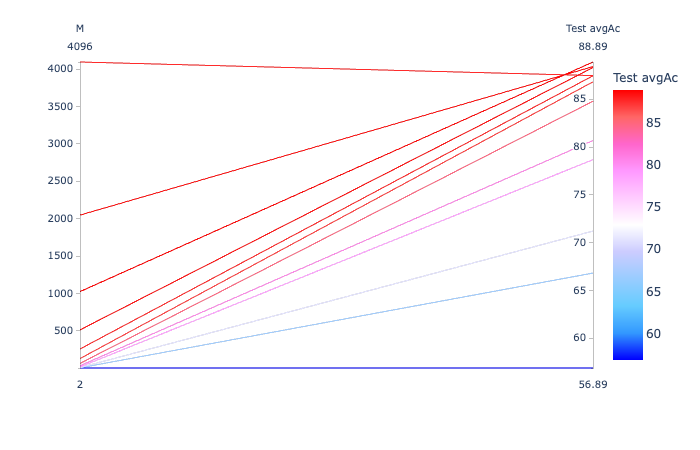
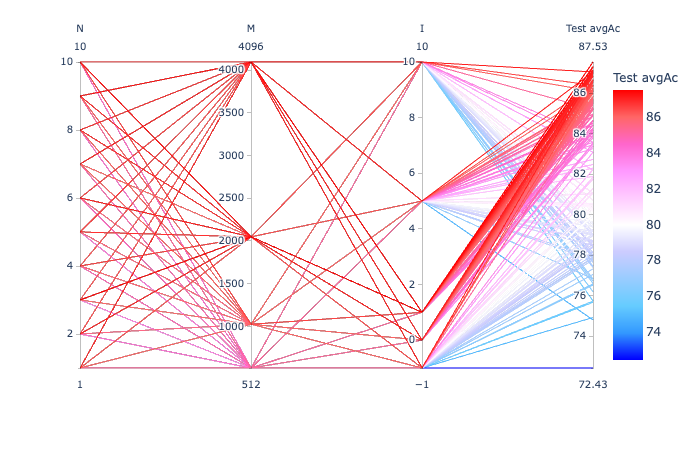
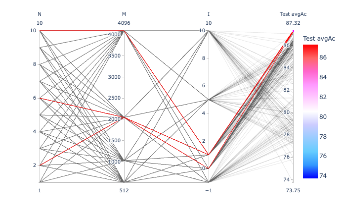
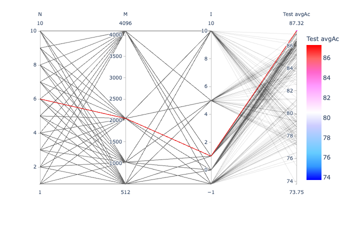
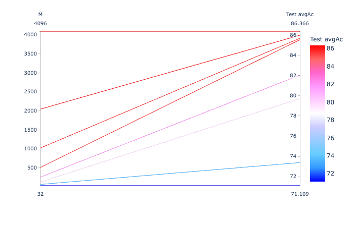

# On a 4.5 hour recording

In this exercise:

- As in exerc05c:

  - P = 20
  - Only classes with at least 200 instances (i.e., 160 for training)

- Classes "I" and "I2" merged into one "II"

## Merging "I" and "I2"

```
$ cp ../exerc01/MARS_20161221_000046_SongSession_16kHz_HPF5HzNorm_labels.csv labels_with_I_and_I2_merged_into_II.csv
```

Then, edit `labels_with_I_and_I2_merged_into_II.csv` to set "II" instead of both "I" and "I2".

## Extracting the individual unit instances

Note: using `-m` option to indicate 200 as minimum number of instances to extract a class.

```
$ ecoz2 sgn extract -m 200 \
                  --segments labels_with_I_and_I2_merged_into_II.csv \
                  --wav ${SOURCE_WAV} \
                  --out-dir data/signals

Loading ...
num_samples: 266117287  sample_rate: 16000  bits_per_sample: 16  sample_format = Int
duration: 16632  sample_period: 0.0000625
parsed selection_ranges = []
parsed time_ranges = []
       F  340 instances
       A  512 instances
      Bm  608 instances
      II  1185 instances
       C  550 instances
      G2  307 instances
       E  713 instances
      I3  324 instances
          4539 total extracted instances
```

## Generating the LPC prediction vector sequences

```
$ ecoz2 lpc -P 20 -W 45 -O 15 -m 200 data/signals

$ ls data/predictors
A  Bm C  E  F  G2 I3 II
```

## Generating the TRAIN and TEST predictor lists

`tt-list.csv` will contain all the available predictor filenames with
~80% per class marked as "TRAIN" and ~20% as "TEST":

```
echo "tt,class,selection" > tt-list.csv
for class in `ls data/predictors/`; do
  ecoz2 util split --train-fraction 0.8 --file-ext .prd --files data/predictors/${class} >> tt-list.csv
done
```

The totals:

```
grep TRAIN tt-list.csv| wc -l
    3629
grep TEST tt-list.csv| wc -l
    910
```

# VQ based classification

VQ based training and classification done with the help of this script:
[vq-exercise.sh](vq-exercise.sh).

Classification results:

(note: results for the various codebook size manually captured in nb-summary.csv.)

```
python3 ./summary-parallel.py nb-summary.csv
```



Looking at the M = 1024 case:

```
ecoz2 vq classify --codebooks data/codebooks/[A-Z]*/eps_0.0005_M_1024.cbook --predictors tt-list.csv --tt=TEST

     Confusion matrix:
            0   1   2   3   4   5   6   7     tests   errors

   A   0  101   0   1   0   0   0   1   0      103       2
  Bm   1    3 105   0   0   0   0   9   5      122      17
   C   2    0   0  95   5   6   1   0   3      110      15
   E   3    0   0  10 127   0   4   0   2      143      16
   F   4    0   0   1   2  64   1   0   0       68       4
  G2   5    0   0   4   4   1  53   0   0       62       9
  I3   6    0   4   0   0   0   0  59   2       65       6
  II   7    0   4   3  22   1   9   5 193      237      44

     class     accuracy    tests      candidate order
   A     0       98.06%   103        101   2   0   0   0   0   0   0
  Bm     1       86.07%   122        105   8   8   1   0   0   0   0
   C     2       86.36%   110         95  10   2   1   0   2   0   0
   E     3       88.81%   143        127  10   4   1   1   0   0   0
   F     4       94.12%    68         64   2   1   0   1   0   0   0
  G2     5       85.48%    62         53   7   2   0   0   0   0   0
  I3     6       90.77%    65         59   6   0   0   0   0   0   0
  II     7       81.43%   237        193  33   8   2   1   0   0   0

       TOTAL     87.58%   910        797  78  25   5   3   2   0   0
  avg_accuracy   88.89%
    error_rate   11.11%
```

# Regular training and classification based on quantized observation sequences

The following as in most of the exercises, that is, first a general codebook generation
phase using all training predictors; then classification with various techniques.

## Codebook generation

Using all TRAIN instances:

```
$ ecoz2 vq learn --prediction-order 20 --epsilon 0.0005 --predictors tt-list.csv
vq_learn: base_codebook_opt=None prediction_order=Some(20), epsilon=0.0005 codebook_class_name=_ predictor_filenames: 3628
...
```

## Vector quantization

Quantize all vectors (TRAIN and TEST) using the various codebook sizes:

```
$ for M in 0032 0064 0128 0256 0512 1024 2048 4096; do
   ecoz2 vq quantize --codebook data/codebooks/_/eps_0.0005_M_${M}.cbook data/predictors
done
```

## HMM training and classification

```
./hmm-exercise.sh

python3 ./summary-parallel.py hmm-summary.csv
```

All parameter combinations that were tried:



Some of the best combinations:



The best combination (N=6, M=2048, I=1):



```
     Confusion matrix:
            0   1   2   3   4   5   6   7     tests   errors

   A   0  102   0   1   0   0   0   0   0      103       1
  Bm   1    3 101   0   0   0   0  16   2      122      21
   C   2    0   0  87   7   5   5   0   6      110      23
   E   3    0   0  11 117   1   9   0   5      143      26
   F   4    0   1   1   2  61   3   0   0       68       7
  G2   5    0   0   2   2   0  57   0   1       62       5
  I3   6    1   2   0   0   0   0  60   2       65       5
  II   7    0   4   5  16   2  10   6 194      237      43

     class     accuracy    tests      candidate order
   A     0       99.03%   103        102   0   1   0   0   0   0   0
  Bm     1       82.79%   122        101  10   7   3   1   0   0   0
   C     2       79.09%   110         87  16   2   4   1   0   0   0
   E     3       81.82%   143        117  15   3   6   2   0   0   0
   F     4       89.71%    68         61   5   1   0   1   0   0   0
  G2     5       91.94%    62         57   3   2   0   0   0   0   0
  I3     6       92.31%    65         60   5   0   0   0   0   0   0
  II     7       81.86%   237        194  30   9   3   1   0   0   0

       TOTAL     85.60%   910        779  84  25  16   6   0   0   0
  avg_accuracy   87.32%
```

---

## Naive Bayes training and classification

```
./nb-exercise.sh

python3 ./summary-parallel.py nb-summary.csv
```



```
     Confusion matrix:
            0   1   2   3   4   5   6   7     tests   errors

A      0   99   0   1   1   0   1   1   0      103       4
Bm     1    3 101   0   0   0   0  16   2      122      21
C      2    0   0  87   5   6   6   0   6      110      23
E      3    0   0  10 111   0  15   0   7      143      32
F      4    0   1   1   2  61   2   0   1       68       7
G2     5    0   0   2   2   0  58   0   0       62       4
I3     6    0   1   0   0   0   0  60   4       65       5
II     7    1   0   3  19   1  16   8 189      237      48

     class     accuracy    tests      candidate order
A        0       96.12%   103         99   3   0   1   0   0   0   0
Bm       1       82.79%   122        101   9   8   2   1   1   0   0
C        2       79.09%   110         87  15   2   5   0   1   0   0
E        3       77.62%   143        111  20   7   5   0   0   0   0
F        4       89.71%    68         61   5   0   1   1   0   0   0
G2       5       93.55%    62         58   3   1   0   0   0   0   0
I3       6       92.31%    65         60   5   0   0   0   0   0   0
II       7       79.75%   237        189  38   6   2   2   0   0   0

       TOTAL     84.18%   910        766  98  24  16   4   2   0   0
  avg_accuracy  86.365685%
    error_rate  13.6343155%
```
