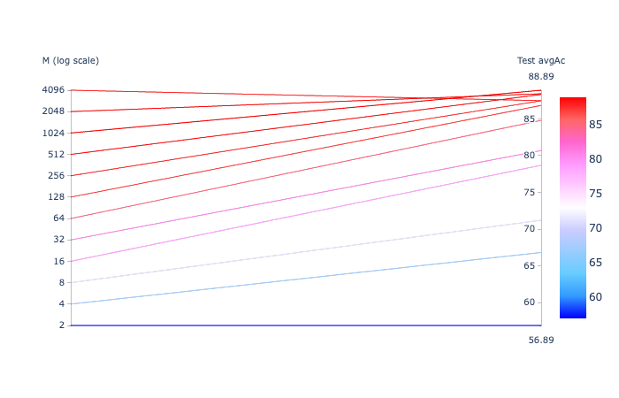
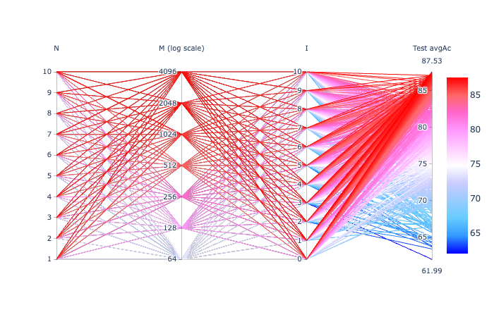
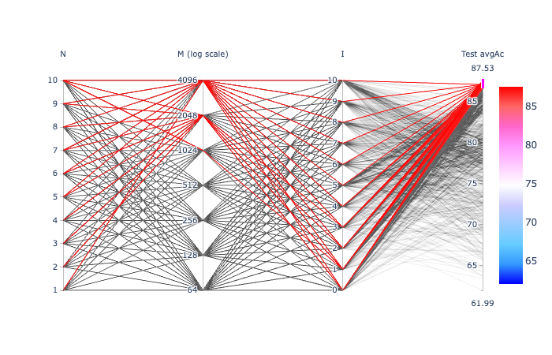
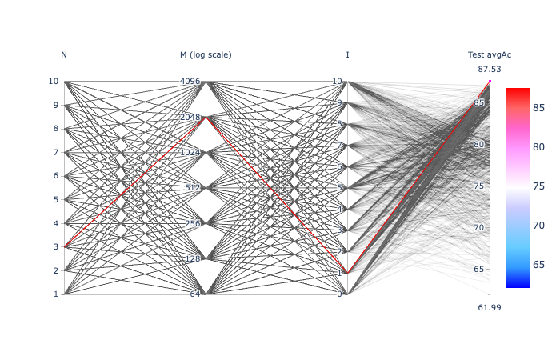
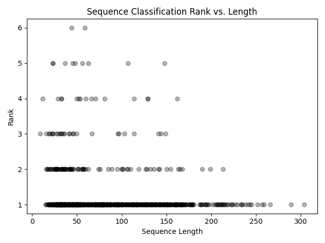
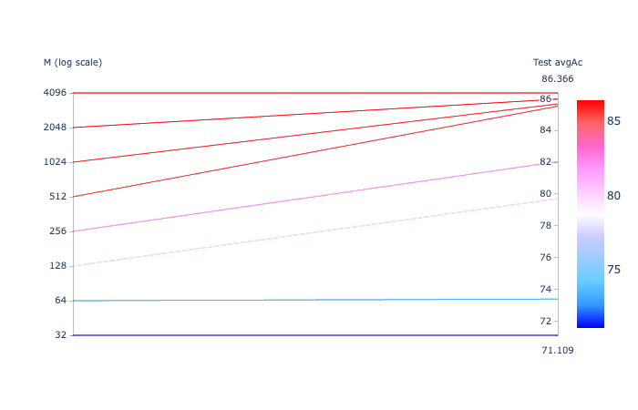
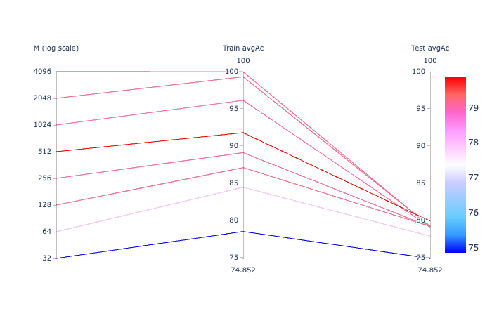

# On a 4.5 hour recording

In this exercise:

- As in exerc05c:

  - P = 20
  - Only classes with at least 200 instances (i.e., 160 for training)

- Classes "I" and "I2" merged into one "II"

## Merging "I" and "I2"

```
$ cp ../exerc01/MARS_20161221_000046_SongSession_16kHz_HPF5HzNorm_labels.csv labels_with_I_and_I2_merged_into_II.csv
```

Then, edit `labels_with_I_and_I2_merged_into_II.csv` to set "II" instead of both "I" and "I2".

## Extracting the individual unit instances

Note: using `-m` option to indicate 200 as minimum number of instances to extract a class.

```
$ ecoz2 sgn extract -m 200 \
                  --segments labels_with_I_and_I2_merged_into_II.csv \
                  --wav ${SOURCE_WAV} \
                  --out-dir data/signals

Loading ...
num_samples: 266117287  sample_rate: 16000  bits_per_sample: 16  sample_format = Int
duration: 16632  sample_period: 0.0000625
parsed selection_ranges = []
parsed time_ranges = []
       F  340 instances
       A  512 instances
      Bm  608 instances
      II  1185 instances
       C  550 instances
      G2  307 instances
       E  713 instances
      I3  324 instances
          4539 total extracted instances
```

## Generating the LPC prediction vector sequences

```
$ ecoz2 lpc -P 20 -W 45 -O 15 -m 200 data/signals

$ ls data/predictors
A  Bm C  E  F  G2 I3 II
```

## Generating the TRAIN and TEST predictor lists

`tt-list.csv` will contain all the available predictor filenames with
~80% per class marked as "TRAIN" and ~20% as "TEST":

```
echo "tt,class,selection" > tt-list.csv
for class in `ls data/predictors/`; do
  ecoz2 util split --train-fraction 0.8 --file-ext .prd --files data/predictors/${class} >> tt-list.csv
done
```

The totals:

```
grep TRAIN tt-list.csv| wc -l
    3629
grep TEST tt-list.csv| wc -l
    910
```

# VQ based classification

VQ based training and classification done with the help of this script:
[vq-exercise.sh](vq-exercise.sh).

Classification results:

(note: results for the various codebook size manually captured in nb-summary.csv.)

```
python3 ./summary-parallel.py vq-summary.csv
```



Looking at the M = 1024 case:

```
ecoz2 vq classify --codebooks data/codebooks/[A-Z]*/eps_0.0005_M_1024.cbook --predictors tt-list.csv --tt=TEST

     Confusion matrix:
            0   1   2   3   4   5   6   7     tests   errors

   A   0  101   0   1   0   0   0   1   0      103       2
  Bm   1    3 105   0   0   0   0   9   5      122      17
   C   2    0   0  95   5   6   1   0   3      110      15
   E   3    0   0  10 127   0   4   0   2      143      16
   F   4    0   0   1   2  64   1   0   0       68       4
  G2   5    0   0   4   4   1  53   0   0       62       9
  I3   6    0   4   0   0   0   0  59   2       65       6
  II   7    0   4   3  22   1   9   5 193      237      44

     class     accuracy    tests      candidate order
   A     0       98.06%   103        101   2   0   0   0   0   0   0
  Bm     1       86.07%   122        105   8   8   1   0   0   0   0
   C     2       86.36%   110         95  10   2   1   0   2   0   0
   E     3       88.81%   143        127  10   4   1   1   0   0   0
   F     4       94.12%    68         64   2   1   0   1   0   0   0
  G2     5       85.48%    62         53   7   2   0   0   0   0   0
  I3     6       90.77%    65         59   6   0   0   0   0   0   0
  II     7       81.43%   237        193  33   8   2   1   0   0   0

       TOTAL     87.58%   910        797  78  25   5   3   2   0   0
  avg_accuracy   88.89%
    error_rate   11.11%
```

# Regular training and classification based on quantized observation sequences

The following as in most of the exercises, that is, first a general codebook generation
phase using all training predictors; then classification with various techniques.

## Codebook generation

Using all TRAIN instances:

```
$ ecoz2 vq learn --prediction-order 20 --epsilon 0.0005 --predictors tt-list.csv
vq_learn: base_codebook_opt=None prediction_order=Some(20), epsilon=0.0005 codebook_class_name=_ predictor_filenames: 3628
...
```

## Vector quantization

Quantize all vectors (TRAIN and TEST) using the various codebook sizes:

```
$ for M in 0032 0064 0128 0256 0512 1024 2048 4096; do
   ecoz2 vq quantize --codebook data/codebooks/_/eps_0.0005_M_${M}.cbook data/predictors
done
```

### Sequence length histograms

See [seq-hists](seq-hists/).

## HMM training and classification

```
./hmm-exercise.sh

python3 ./summary-parallel.py hmm-summary.csv
```

All parameter combinations that were tried:



Some of the best combinations:



The best combination (`N=3, M=2048, I=1`; `A=0.3` not plotted):



```
ecoz2 hmm classify --c12n c12n/TEST/N3__M2048_t3__a0.3_I1.csv \
                   --models data/hmms/N3__M2048_t3__a0.3_I1 \
                   -M=2048 --tt=TEST --sequences tt-list.csv
```

```
     Confusion matrix:
            0   1   2   3   4   5   6   7     tests   errors

   A   0  102   0   1   0   0   0   0   0      103       1
  Bm   1    3 103   0   0   0   0  14   2      122      19
   C   2    0   0  89   7   5   5   0   4      110      21
   E   3    0   0   9 116   0  12   0   6      143      27
   F   4    0   1   1   2  62   2   0   0       68       6
  G2   5    0   0   2   3   0  57   0   0       62       5
  I3   6    1   2   0   0   0   0  60   2       65       5
  II   7    0   2   4  19   5  13   6 188      237      49

     class     accuracy    tests      candidate order
   A     0       99.03%   103        102   1   0   0   0   0   0   0
  Bm     1       84.43%   122        103  10   5   1   2   1   0   0
   C     2       80.91%   110         89  13   3   4   1   0   0   0
   E     3       81.12%   143        116  15   3   5   3   1   0   0
   F     4       91.18%    68         62   3   1   1   1   0   0   0
  G2     5       91.94%    62         57   4   1   0   0   0   0   0
  I3     6       92.31%    65         60   5   0   0   0   0   0   0
  II     7       79.32%   237        188  29  14   4   2   0   0   0

       TOTAL     85.38%   910        777  80  27  15   9   2   0   0
  avg_accuracy   87.53%
```

### Sequence Classification Rank vs. Length

```
python3 seq-len-rank-scatter.py c12n/TEST/N3__M2048_t3__a0.3_I1.csv seq-hists/seq-lengths.csv
```



- Correct classifications (`rank=1`) seem pretty well distributed across the
  various sequence lengths (see histogram below)
- Incorrect classifications seem to also align with the overall
  sequence length distribution.
  In other words, as one would expect, classification accuracy should not be
  impacted by the sequence length per se.

## 

## Naive Bayes training and classification

```
./nb-exercise.sh

python3 ./summary-parallel.py nb-summary.csv
```



For `M=4096`:

```
ecoz2 nb classify --models data/nbs/M${M} -M=${M} --tt=TEST --sequences tt-list.csv
```

```
     Confusion matrix:
            0   1   2   3   4   5   6   7     tests   errors

A      0   99   0   1   1   0   1   1   0      103       4
Bm     1    3 101   0   0   0   0  16   2      122      21
C      2    0   0  87   5   6   6   0   6      110      23
E      3    0   0  10 111   0  15   0   7      143      32
F      4    0   1   1   2  61   2   0   1       68       7
G2     5    0   0   2   2   0  58   0   0       62       4
I3     6    0   1   0   0   0   0  60   4       65       5
II     7    1   0   3  19   1  16   8 189      237      48

     class     accuracy   tests       candidate order
A        0       96.12%     103         99    3    0    1    0    0    0    0
Bm       1       82.79%     122        101    9    8    2    1    1    0    0
C        2       79.09%     110         87   15    2    5    0    1    0    0
E        3       77.62%     143        111   20    7    5    0    0    0    0
F        4       89.71%      68         61    5    0    1    1    0    0    0
G2       5       93.55%      62         58    3    1    0    0    0    0    0
I3       6       92.31%      65         60    5    0    0    0    0    0    0
II       7       79.75%     237        189   38    6    2    2    0    0    0

       TOTAL     84.18%     910        766   98   24   16    4    2    0    0
  avg_accuracy   86.37%
```

## Markov chain model training and classification

```
./mm-exercise.sh

python3 ./summary-parallel.py mm-summary.csv show-train
```

In this plot we also include the average accuraccy over the training instances ('Train avgAc')
as a way to easily compare it with the average accuracy over the test instances.



For `M=512`:

```
ecoz2 mm classify --models data/mms/M512 -M=512 --tt=TEST --sequences tt-list.csv
```

```
     Confusion matrix:
            0   1   2   3   4   5   6   7     tests   errors

A      0  101   0   1   1   0   0   0   0      103       2
Bm     1    3 110   2   0   0   1   0   6      122      12
C      2    0   0 106   1   3   0   0   0      110       4
E      3    0   0  43  92   2   6   0   0      143      51
F      4    0   0   3   1  64   0   0   0       68       4
G2     5    0   0  14   2   0  46   0   0       62      16
I3     6    4  13   0   0   0   0  38  10       65      27
II     7    1   8  46  15   3  13   1 150      237      87

     class     accuracy   tests       candidate order
A        0       98.06%     103        101    1    0    1    0    0    0    0
Bm       1       90.16%     122        110    4    4    3    1    0    0    0
C        2       96.36%     110        106    3    0    1    0    0    0    0
E        3       64.34%     143         92   29    9    6    7    0    0    0
F        4       94.12%      68         64    3    1    0    0    0    0    0
G2       5       74.19%      62         46   11    5    0    0    0    0    0
I3       6       58.46%      65         38   20    6    1    0    0    0    0
II       7       63.29%     237        150   51   22    8    6    0    0    0

       TOTAL     77.69%     910        707  122   47   20   14    0    0    0
  avg_accuracy   79.87%
```
