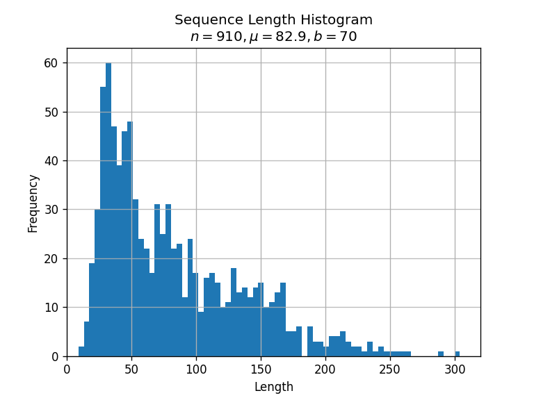
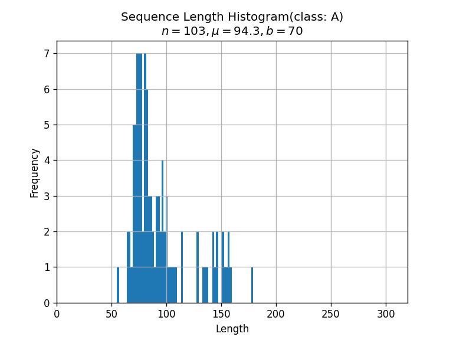
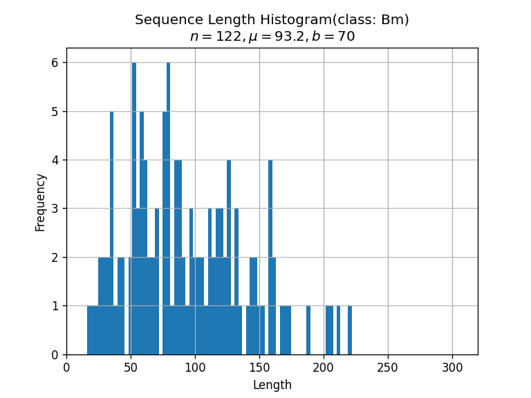
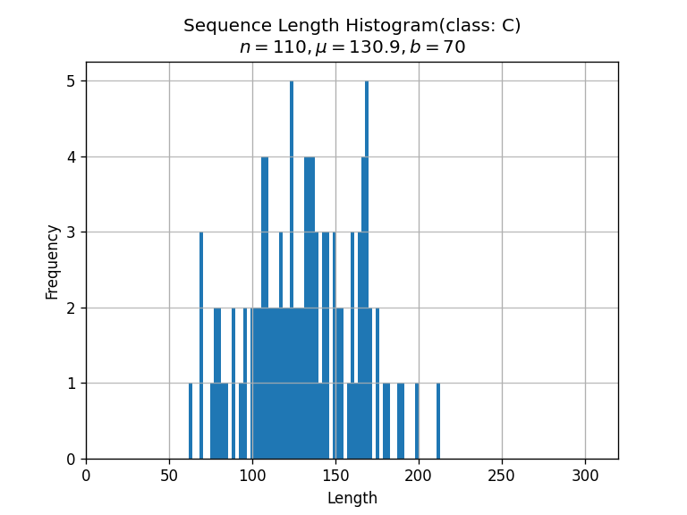
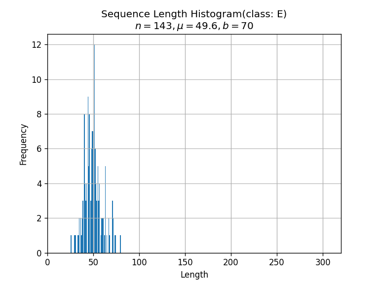
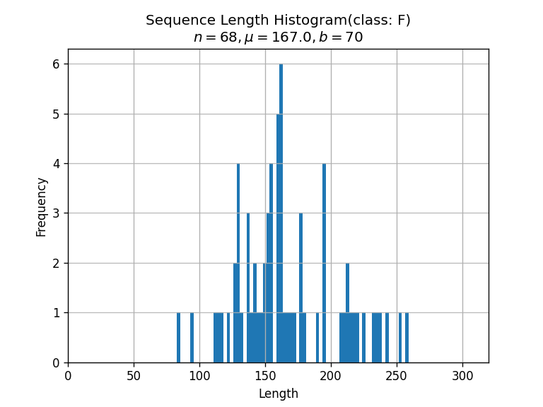
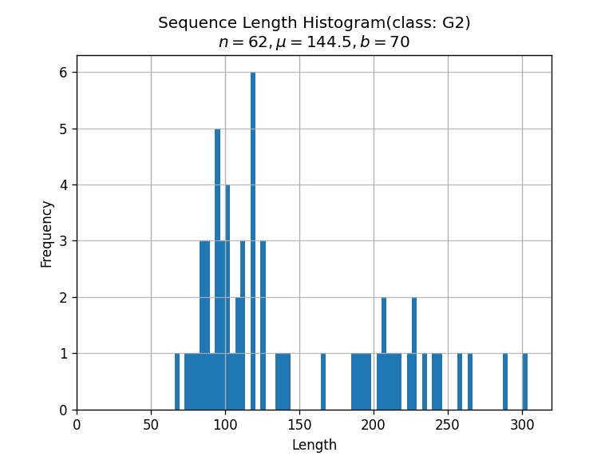
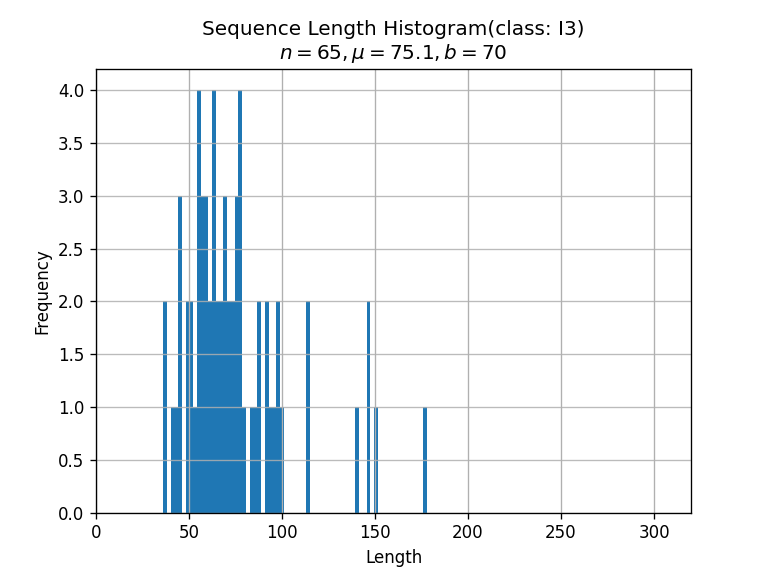
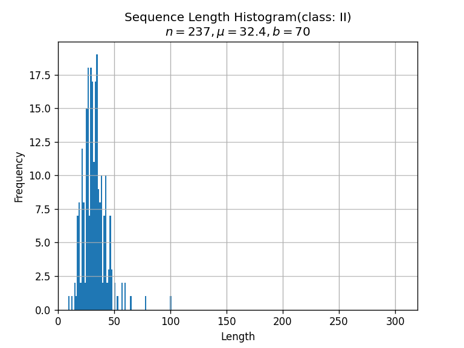

## Sequence length histograms

Based on the TEST sequences.

In each of the plots below:

- `n` is the number of sequences
- `µ` is the average sequence length
- `b` is the number of bins
- `Length` is given in number of analysis frames.
  With the 15ms window offset, this means that
  100 units in the x axis corresponds to about 1.5secs

All plots on the same `x` axis range to facilitate comparison.

First plot with sequences across all classes:

Per class:

